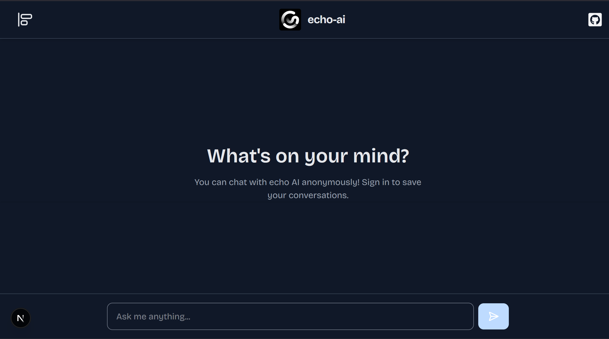

# Echo AI - Your AI Assistant

A modern, intelligent AI chatbot built with Next.js, Clerk authentication, and Supabase. Chat with AI anonymously or sign in to save your conversations.



## ✨ Features

- 🤖 **AI Chat Interface** - Powered by Google's Gemini 1.5 Flash model
- 🔓 **Anonymous Chat** - Chat with AI without signing up
- 💾 **Conversation History** - Save and access your chat history when signed in
- 🔐 **Secure Authentication** - Powered by Clerk
- 📱 **Responsive Design** - Works seamlessly on desktop and mobile
- 🎨 **Modern UI** - Clean, dark theme with smooth animations
- 📝 **Markdown Support** - Rich text formatting and code highlighting
- 🔍 **Session Management** - Organize conversations with automatic titles

## 🚀 Live Demo

Visit the live application: [https://echo-ai-sooty.vercel.app/](https://echo-ai-sooty.vercel.app/)

## 🛠️ Tech Stack

- **Frontend**: Next.js 15, React 19, TypeScript
- **Authentication**: Clerk
- **Database**: Supabase
- **AI Model**: Google Gemini 1.5 Flash
- **Styling**: Tailwind CSS
- **UI Components**: Radix UI, Lucide React
- **Markdown**: React Markdown with syntax highlighting

## 📋 Prerequisites

Before you begin, ensure you have the following installed:
- Node.js (v18 or higher)
- npm or yarn
- A Clerk account
- A Supabase account
- Google AI API access

## 🚀 Getting Started

### 1. Clone the Repository

```bash
git clone https://github.com/emmamayne23/echo-ai-chatbot.git
cd echo-ai
```

### 2. Install Dependencies

```bash
npm install
```

### 3. Environment Variables

Create a `.env.local` file in the root directory:

```env
# Clerk Authentication
NEXT_PUBLIC_CLERK_PUBLISHABLE_KEY=your_clerk_publishable_key
CLERK_SECRET_KEY=your_clerk_secret_key

# Supabase Database
NEXT_PUBLIC_SUPABASE_URL=your_supabase_url
NEXT_PUBLIC_SUPABASE_ANON_KEY=your_supabase_anon_key

# Google AI
GOOGLE_GENERATIVE_AI_API_KEY=your_google_ai_api_key
```

### 4. Database Setup

Create the following tables in your Supabase database:

#### Users Table
```sql
CREATE TABLE users (
  id UUID DEFAULT gen_random_uuid() PRIMARY KEY,
  clerk_user_id TEXT UNIQUE NOT NULL,
  name TEXT,
  email TEXT,
  created_at TIMESTAMP WITH TIME ZONE DEFAULT NOW(),
  updated_at TIMESTAMP WITH TIME ZONE DEFAULT NOW()
);
```

#### Sessions Table
```sql
CREATE TABLE session (
  id UUID DEFAULT gen_random_uuid() PRIMARY KEY,
  title TEXT NOT NULL,
  user_id TEXT REFERENCES users(clerk_user_id),
  created_at TIMESTAMP WITH TIME ZONE DEFAULT NOW(),
  updated_at TIMESTAMP WITH TIME ZONE DEFAULT NOW()
);
```

#### Messages Table
```sql
CREATE TABLE messages (
  id UUID DEFAULT gen_random_uuid() PRIMARY KEY,
  session_id UUID REFERENCES session(id) ON DELETE CASCADE,
  role TEXT NOT NULL CHECK (role IN ('user', 'assistant')),
  content TEXT NOT NULL,
  created_at TIMESTAMP WITH TIME ZONE DEFAULT NOW()
);
```

### 5. Run the Development Server

```bash
npm run dev
```

Open [http://localhost:3000](http://localhost:3000) to view the application.

## 🏗️ Project Structure

```
echo-ai/
├── app/                    # Next.js app directory
│   ├── api/               # API routes
│   │   └── chat/          # Chat API endpoint
│   ├── chat/              # Chat session pages
│   ├── globals.css        # Global styles
│   ├── layout.tsx         # Root layout
│   └── page.tsx           # Home page
├── components/            # React components
│   ├── Chat.tsx           # Main chat interface
│   ├── Navbar.tsx         # Navigation bar
│   └── video-text.tsx     # Video text component
├── lib/                   # Utility functions
│   ├── actions/           # Server actions
│   │   ├── general.actions.ts
│   │   └── message.actions.ts
│   ├── supabase.ts        # Supabase client
│   └── utils.ts           # Utility functions
├── middleware.ts          # Clerk middleware
├── public/                # Static assets
└── package.json           # Dependencies
```

## 🎯 Key Features Explained

### Anonymous Chat
Users can chat with the AI without creating an account. Conversations are not saved to the database.

### Authenticated Chat
When users sign in, their conversations are automatically saved and can be accessed later.

### Session Management
Each conversation is organized into sessions with automatically generated titles based on the first message.

### Real-time AI Responses
Powered by Google's Gemini 1.5 Flash model with streaming responses for a smooth user experience.

## 🔧 Configuration

### Clerk Setup
1. Create a new application in Clerk Dashboard
2. Configure authentication methods (email, social logins)
3. Add your domain to allowed origins
4. Copy the publishable and secret keys to your environment variables

### Supabase Setup
1. Create a new Supabase project
2. Set up the database tables as shown above
3. Configure Row Level Security (RLS) policies
4. Copy the URL and anon key to your environment variables

### Google AI Setup
1. Get API access to Google's Generative AI
2. Generate an API key
3. Add the key to your environment variables

## 🚀 Deployment

### Vercel (Recommended)
1. Push your code to GitHub
2. Connect your repository to Vercel
3. Add environment variables in Vercel dashboard
4. Deploy!

### Other Platforms
The application can be deployed to any platform that supports Next.js:
- Netlify
- Railway
- DigitalOcean App Platform
- AWS Amplify

## 🤝 Contributing

1. Fork the repository
2. Create a feature branch (`git checkout -b feature/amazing-feature`)
3. Commit your changes (`git commit -m 'Add some amazing feature'`)
4. Push to the branch (`git push origin feature/amazing-feature`)
5. Open a Pull Request

## 📝 License

This project is licensed under the MIT License - see the [LICENSE](LICENSE) file for details.

## 🙏 Acknowledgments

- [Next.js](https://nextjs.org/) for the amazing React framework
- [Clerk](https://clerk.com/) for authentication
- [Supabase](https://supabase.com/) for the database
- [Google AI](https://ai.google.dev/) for the AI model
- [Tailwind CSS](https://tailwindcss.com/) for styling
- [Vercel](https://vercel.com/) for hosting

## 📞 Support

If you have any questions or need help, please open an issue on GitHub or contact the maintainers.

---

Made with ❤️ by [Emma Mayne](https://github.com/emmamayne23)
